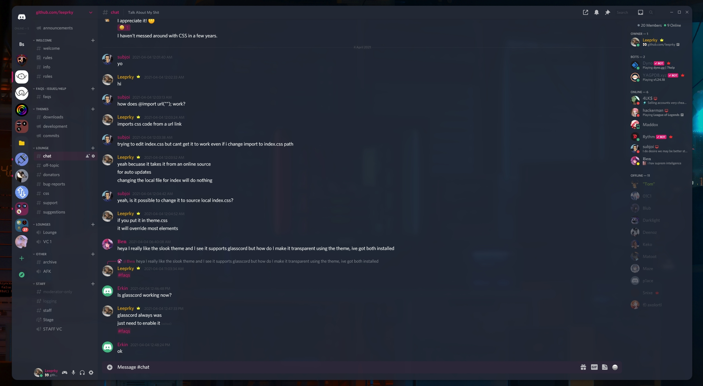

## Naive
A Discord theme with easy config and sleek user UI and design. With support for multiple clients & glasscord.

## INFO

Naive Offers Multiple Colors

Cherry:
Cherry Light: 
Buzzy:
Sky:
Apple:
Hell: 

- Any Issues DM Leeprky#2063
  Hope You Enjoy!

## How To Install Naive

> Head to C:\Users\[USER]\powercord\src\Powercord

> Right Click "themes" and click Git Bash Here

> Type "git clone https://github.com/leeprky/Naive"

> Refresh Discord

## License

MIT, see LICENSE.md for more details

## Previews

